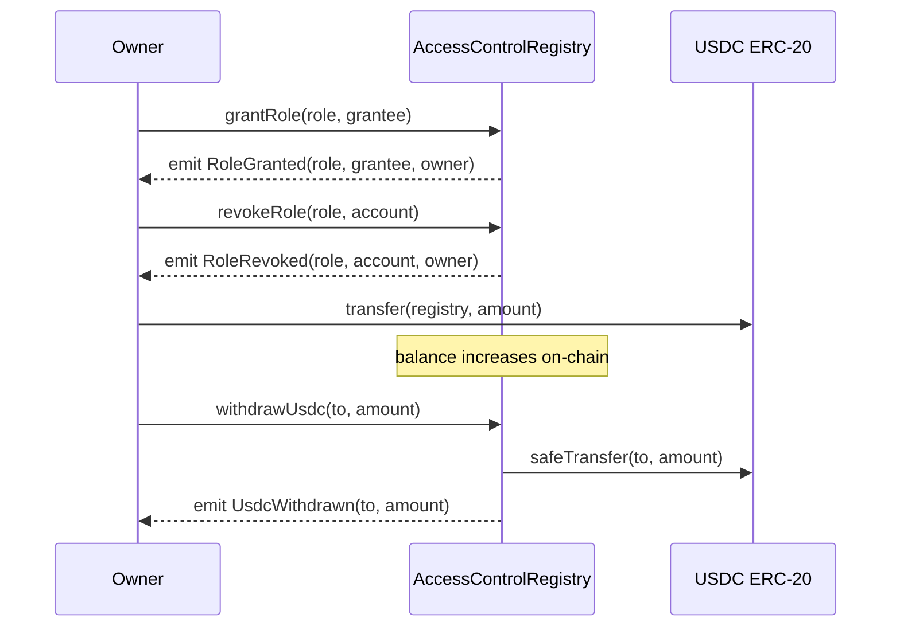

# AccessControlRegistry — Smart Contract Design Doc

**Status:** Draft  
**Authors:** Arc Studio  
**Target chain:** Arc Testnet (EVM, Paris hardfork)  
**Language / toolchain:** Solidity 0.8.28, Foundry (forge)  
**Milestone:** v1.0 — initial deploy  

**Review tracker:**
- [ ] Design review
- [ ] Security review
- [ ] Ops review

---

## 1. Action Items (living)

_Starts empty. Fill with feedback resolution bullets after each review round._

---

## 2. Goals / Non-Goals

### Goals
- Provide a single, immutable on-chain registry that tracks which addresses hold which named roles.
- Allow a single owner (deployer) to grant and revoke roles with full audit-trail events.
- Allow the registry to hold a USDC balance that only the owner may withdraw (treasury function).
- Expose a pausable surface: when paused, no role changes are accepted.
- Enforce a two-step ownership transfer so the owner key cannot be silently transferred.

### Non-Goals
- No upgradeability — the contract is immutable after deployment.
- No role delegation or sub-roles — the owner is the sole admin.
- No ERC-20 minting or token functionality — USDC is held, not minted.
- No cross-chain messaging.
- No time-locks or governance voting.

---

## 3. Requirements

### Functional
- Owner may grant any `bytes32` role to any non-zero address.
- Owner may revoke any role from any address.
- Owner may pause and unpause the registry.
- Owner may deposit USDC (via ERC-20 transfer into the contract) and withdraw it.
- Any address may check whether another address holds a given role.
- Ownership may be transferred in two steps: propose then accept.

### Security
- No non-owner may grant or revoke roles.
- No non-owner may withdraw funds.
- Role changes are rejected when the contract is paused.
- Zero addresses may never be granted a role.
- `renounceOwnership` is disabled — the owner can never be set to zero.
- All fund movements use `SafeERC20` to handle non-standard token behavior.
- Reentrancy guard on all fund-moving functions.

---

## 4. Terminology & Actors

| Term | Definition |
|---|---|
| Role | A `bytes32` identifier representing a named permission (e.g. `keccak256("OPERATOR")`) |
| Owner | The single privileged address; deployer by default |
| Pending owner | The address that has been nominated for ownership transfer; must accept before it takes effect |
| Grantee | An address that has been granted one or more roles |
| USDC | The ERC-20 stablecoin held by the registry; address provided at deploy time |

**Actors table:**

| Actor | On/Off-chain | Trust level | Capabilities |
|---|---|---|---|
| Owner | On-chain EOA or multi-sig | Trusted | Grant/revoke roles, pause/unpause, withdraw USDC, initiate ownership transfer |
| Pending owner | On-chain EOA | Semi-trusted | Accept (complete) an ownership transfer |
| Any address | On-chain | Untrusted | Read role membership (`hasRole`) |

---

## 5. Language / Runtime

- **Language:** Solidity `^0.8.20` (tested with 0.8.28)
- **Compiler:** `forge build`; `foundry.toml` pins `evm_version = "paris"` (Arc Testnet target)
- **OpenZeppelin:** 5.1.0 (the sandbox-pinned version compatible with the Paris EVM — 5.2+ uses Cancun-only opcodes)
- **Base contracts used:** `Ownable2Step`, `Pausable`, `ReentrancyGuard`, `SafeERC20`

---

## 6. Transaction & Execution Model

Execution is atomic — all state is committed or all reverted. The only external call is the USDC ERC-20 transfer (via `SafeERC20`). CEI (Checks-Effects-Interactions) ordering is applied: state changes precede the external USDC call on withdrawal. `ReentrancyGuard` (`nonReentrant`) is applied to `withdrawUsdc`.

---

## 7. Chain Standards & Interfaces

- No ERC-20/721/1155 implementation — the registry holds ERC-20 (USDC) but does not issue tokens.
- `IERC20` + `SafeERC20` used for USDC interactions.

---

## 8. Architecture Overview



**Flow of funds:**

| Step | Who moves what | Invariant that must hold |
|---|---|---|
| 1. Owner sends USDC to contract | Owner → Registry (standard ERC-20 transfer) | Registry USDC balance = sum of all deposits − sum of all withdrawals |
| 2. Owner calls `withdrawUsdc(to, amount)` | Registry → `to` (ERC-20 transfer) | `amount ≤ Registry USDC balance`; balance decreases by exactly `amount` |

**Resting-state invariant:** the contract may hold USDC at rest (that is the intended treasury function); it holds no native coin.

---

## 9. Contract Design

### Roles (contract roles, not registry roles)

| Role | Holder count | Permissions | Why it exists |
|---|---|---|---|
| `owner` (OZ `Ownable2Step`) | 1 | Grant/revoke registry roles, pause/unpause, withdraw USDC, initiate ownership transfer | Single admin key per spec |
| `pendingOwner` | 0 or 1 | Accept ownership transfer | Two-step transfer safety |

### Storage layout

```
// Inherited from Ownable2Step
address private _owner;
address private _pendingOwner;

// Inherited from Pausable
bool private _paused;

// Inherited from ReentrancyGuard
uint256 private _status;

// Contract state
IERC20 public usdcToken;                             // set in constructor, immutable
mapping(bytes32 role => mapping(address account => bool)) private _roles;
```

No upgradeability → no `__gap` or EIP-7201 namespaced storage required.

### Modifiers

| Modifier | Guard |
|---|---|
| `onlyOwner` (inherited) | `msg.sender == owner()` |
| `whenNotPaused` (inherited) | `!paused()` |
| `nonReentrant` (inherited) | Reentrancy guard |

### Functions — write surface

| Function | Caller | State mutated | Events | Revert conditions |
|---|---|---|---|---|
| `constructor(address usdcToken_, address initialOwner)` | Deployer (once) | Sets `usdcToken`, transfers ownership to `initialOwner` | `OwnershipTransferred(0, initialOwner)` | `usdcToken_` or `initialOwner` is zero |
| `grantRole(bytes32 role, address account)` | Owner | `_roles[role][account] = true` | `RoleGranted(role, account, msg.sender)` | Not owner; paused; `account` is zero; role already held |
| `revokeRole(bytes32 role, address account)` | Owner | `_roles[role][account] = false` | `RoleRevoked(role, account, msg.sender)` | Not owner; paused; role not held |
| `pause()` | Owner | `_paused = true` | `Paused(msg.sender)` | Not owner; already paused |
| `unpause()` | Owner | `_paused = false` | `Unpaused(msg.sender)` | Not owner; not paused |
| `withdrawUsdc(address to, uint256 amount)` | Owner | Calls `safeTransfer` | `UsdcWithdrawn(to, amount)` | Not owner; `to` is zero; `amount` is zero; insufficient balance; reentrancy guard |
| `transferOwnership(address newOwner)` | Owner | `_pendingOwner = newOwner` | `OwnershipTransferStarted(owner, newOwner)` | Not owner; `newOwner` is zero |
| `acceptOwnership()` | Pending owner | `_owner = pendingOwner; _pendingOwner = 0` | `OwnershipTransferred(old, new)` | Not pending owner |
| `renounceOwnership()` | — | Reverts unconditionally | — | Always reverts (disabled) |

### Events

| Event | Parameters | When emitted |
|---|---|---|
| `RoleGranted` | `bytes32 indexed role, address indexed account, address indexed sender` | Role assigned to account |
| `RoleRevoked` | `bytes32 indexed role, address indexed account, address indexed sender` | Role removed from account |
| `UsdcWithdrawn` | `address indexed to, uint256 amount` | USDC transferred out by owner |

---

## 10. Deployment & Initialization

- **Constructor args:** `address usdcToken_` (Arc Testnet USDC address), `address initialOwner` (deployer / platform wallet)
- Both args are validated non-zero in the constructor.
- No `initialize` function — not upgradeable, no proxy.
- Post-deploy: owner holds all permissions; registry is unpaused; USDC balance is zero.
- **Init runbook:**
  1. Deploy with `usdcToken_` = Arc Testnet USDC, `initialOwner` = deployer wallet.
  2. Verify `owner()` returns deployer.
  3. Verify `paused()` returns `false`.

---

## 11. Upgradeability

**Not upgradeable.** The contract is immutable after deployment. Migration path: deploy a new contract, re-grant roles, re-point integrators. There is no proxy and no `_disableInitializers` call (plain constructor, no proxy).

---

## 12. Key Management & Signing

- Owner key held by deployer (platform wallet for testnet; user-controlled for mainnet).
- No off-chain signatures — all privileged operations are on-chain transactions by `msg.sender`.
- No EIP-712, no nonces, no Permit2.

---

## 13. Security Considerations

| Vulnerability | Applicable? | Mitigation |
|---|---|---|
| Reentrancy | Yes — `withdrawUsdc` makes an external ERC-20 call | `nonReentrant` on `withdrawUsdc`; CEI ordering (state checks before transfer) |
| Access control | Yes — every write function is privileged | `onlyOwner` on all write functions; `_roles` mapping is private |
| Integer overflow/underflow | Solidity ≥0.8 checked arithmetic | No `unchecked` blocks anywhere |
| Unchecked external call / return | Yes — USDC transfer | `SafeERC20.safeTransfer` handles non-standard ERC-20s |
| Fee-on-transfer / rebasing tokens | Low — USDC is not fee-on-transfer | Balance check after transfer not required for standard USDC; acceptable known scope |
| Signature replay | N/A — no signature verification | — |
| Front-running / MEV | Low — no value extraction path for non-owner | Owner is trusted; no value available to untrusted callers |
| Flash-loan / price manipulation | N/A — no price oracle | — |
| Oracle manipulation | N/A — no oracle used | — |
| Denial of service | Low — no loops; pull-over-push for withdrawals | Single `safeTransfer` per withdrawal; no bounded-loop risk |
| Delegatecall / proxy safety | N/A — not upgradeable | — |
| Timestamp / block dependence | N/A — no time-based logic | — |
| Approval persistence | N/A — registry holds tokens, does not approve | — |
| Centralization risk | Yes — single owner has full control | Documented in trust model; two-step ownership transfer; `renounceOwnership` disabled |

---

## 14. Trust Model & Threat Analysis

| Actor | Max damage if compromised | Mitigation | Detection |
|---|---|---|---|
| Owner key | Drain USDC balance; grant any role to any address; pause the registry | Use a hardware wallet or multi-sig in production; two-step transfer requires active acceptance | Monitor `RoleGranted`, `UsdcWithdrawn`, `OwnershipTransferStarted` events |
| Grantee | None beyond what the consuming application gives them — the registry itself has no on-chain effect for grantees | Roles are advisory; consuming app enforces meaning | Monitor `RoleGranted` / `RoleRevoked` events |

---

## 15. Emergency Response & Circuit Breakers

- **Pause:** owner calls `pause()` — all role changes (`grantRole`, `revokeRole`) revert until `unpause()`.
- **USDC rescue:** owner calls `withdrawUsdc(owner(), balance)` to recover all USDC.
- No separate Rescuer or Pauser role (single-owner scope per spec). In production, consider replacing the owner with a multi-sig before adding significant USDC balance.

---

## 16. Failure Scenarios

| Scenario | Outcome |
|---|---|
| Owner calls `grantRole` while paused | Reverts with `EnforcedPause` |
| Non-owner calls `grantRole` | Reverts with `OwnableUnauthorizedAccount` |
| Owner calls `withdrawUsdc` with amount > balance | Reverts with `ERC20InsufficientBalance` (via `SafeERC20`) |
| Ownership `transferOwnership` called but new owner never calls `acceptOwnership` | `_pendingOwner` sits set; current owner retains control; no lock-in |
| Owner calls `renounceOwnership` | Always reverts — ownership cannot be abandoned |

---

## 17. Priorities & Tradeoffs

| Decision | Tradeoff | Rationale |
|---|---|---|
| Single owner, no roles beyond owner | Simpler attack surface vs. less flexibility | User specified single-owner; roles are registry entries, not contract-level ACL |
| Immutable — no proxy | Cannot patch bugs post-deploy | User specified immutable; simpler, no proxy risk |
| `Ownable2Step` over `Ownable` | Two-step transfer costs one extra tx | Prevents fat-finger / social-engineering transfers to wrong address |
| `renounceOwnership` disabled | No way to fully decentralize | Owner with zero address = locked contract; rejected as more dangerous than centralization |
| USDC-only treasury | Cannot hold arbitrary tokens | Scope; other ERC-20s can be added in a v2 |

---

## 18. Testing Strategy

- **Unit tests:** Foundry `.t.sol` — happy path, revert paths, events, fuzz `grantRole`/`revokeRole` with arbitrary `bytes32` roles and addresses.
- **Coverage target:** 100% branch coverage on all write functions.
- **Invariant:** at no point can a non-owner account modify `_roles` or withdraw USDC.
- **Static analysis:** Slither on production source.
- **Run command:** `forge test -vvv` from `/home/user/app`

---

## 19. Third-party Libraries

| Library | Version | Dependency? | Why chosen | Security reviewed? |
|---|---|---|---|---|
| `@openzeppelin/contracts` | 5.1.0 | Yes (pinned) | `Ownable2Step`, `Pausable`, `ReentrancyGuard`, `SafeERC20` — industry-standard, audited | Yes (multiple public audits) |
